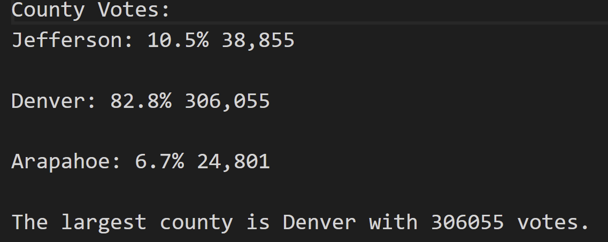
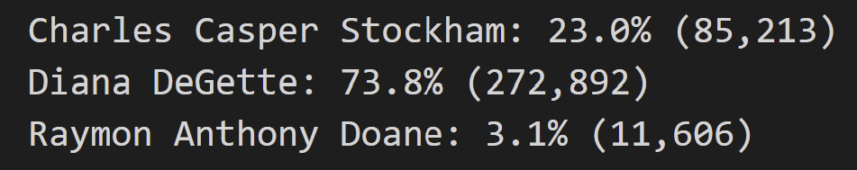

# Election Analysis
##  Overview of Election Audit
 After assisting Tom and Seth submit the audit results to the election commission, the election commission requested additional data to finalize the results. The election commission requested information on the voter turnout, amount of highest votes per candidate and county, and percentages based on votes. The purpose of this analysis is to provide any additional data they might need to finalize their audit.
 ## Election-Audit Results
 - **How many votes were cast in this congressional election?**
 ## 
 The total amount of votes in the election were 369,711. The leading county with the most amount of votes was Denver with 306,055 and 82.8% of votes, followed by Jefferson with 38,855 and 10.5% of votes, and in last place was Arapahoe with 24,801 and 6.7% of votes.
 ##
 -  **Which county had the largest amount of votes?**
   ##
Denver was the leading county with the most amount of votes in this election. Denver generated over 82% of the toal votes with 306,055.

##
- **Which candidate won the election, what was their vote count and percentage of the total votes?** 
##
It's very clear that the winner of the election with 272,892 votes, which makes up 73% of votes, was Dianna DeGette. The candidate who came in second place was Charles Casper Stockham with 85,213 votes and a total of 23%, and in last place is Raymon Anthony Doane with only 3.1% of votes at 11,606.

## Election-Results Summary

This script can easily be used for future elections by changing the CSV file that was used. By taking a look at like 9, you will see a "file to load" text, and on that line we can easily load a new file and view results of a different election. Furthermore, you could also make changes form county to state to use this script for a larger election. 